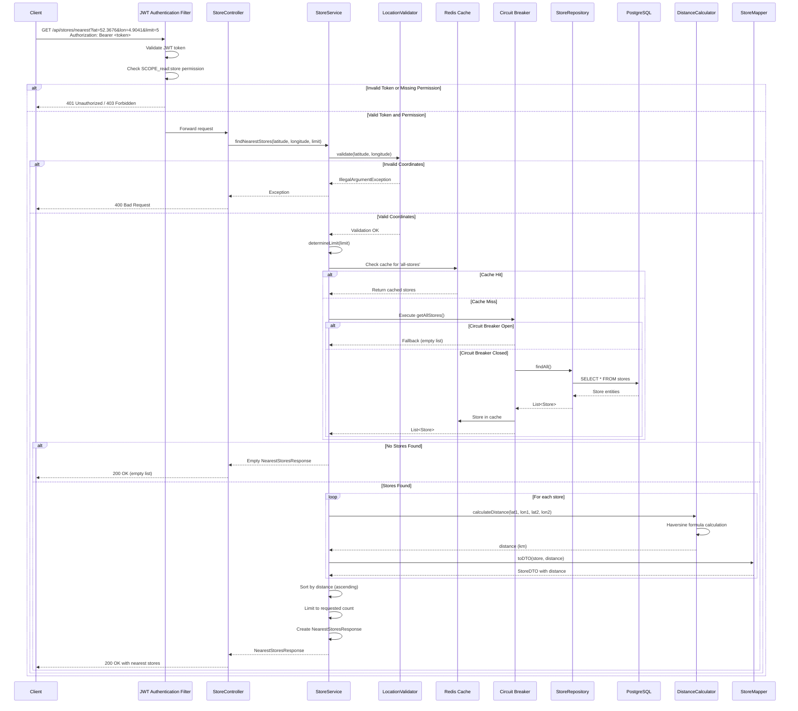

# 🏪 store-service

**Version:** 0.0.1-SNAPSHOT

**store-service** is a REST API microservice written in Java 21 with Spring Boot 3.5, designed to find the nearest Jumbo stores to a given geographical location.

---

## 🚀 Features

- ✅ **Store Location Search** - Find nearest stores using Haversine distance calculation
- 🔐 **JWT Authentication** - Secure token-based authentication with configurable expiration
- 🔑 **Role-Based Authorization** - Customer role with `read:store` permission
- 🧱 **Clean Architecture** - Modular service/repository/controller layers following SOLID principles
- 📨 **Request Validation** - Comprehensive input validation for coordinates and parameters
- 🚦 **Circuit Breaker** - Resilience4j circuit breaker for fault tolerance
- 💾 **Redis Caching** - In-memory caching to reduce database load
- 🩺 **Health Checks** - Actuator endpoints for health monitoring
- 🧪 **Comprehensive Testing** - Unit and integration tests using Testcontainers
- 📖 **API Documentation** - Auto-generated Swagger/OpenAPI docs with interactive UI
- 🗄️ **Database Migrations** - Flyway-based migration system
- 🐳 **Docker Support** - Multi-stage Docker builds and Docker Compose setup
- 📊 **Code Coverage** - JaCoCo integration for test coverage reporting
- 🔍 **Code Quality** - SonarCloud integration via GitHub Actions

---

## 🧱 Stack

| Layer       | Tech                               |
|-------------|------------------------------------|
| Language    | Java 21                            |
| Framework   | Spring Boot 3.5                    |
| Database    | PostgreSQL 16                      |
| Cache       | Redis 7                            |
| Auth        | JWT (JJWT) + Spring Security       |
| Migrations  | Flyway                             |
| Testing     | JUnit 5 + AssertJ + Testcontainers |
| Docs        | Springdoc OpenAPI (Swagger)        |
| Resilience  | Resilience4j Circuit Breaker       |
| Build       | Maven                              |
| Coverage    | JaCoCo                             |
| Quality     | SonarCloud                         |

---

## 🧑‍💻 Getting Started

### 📦 Requirements

- Docker + Docker Compose
- Java 21+
- Maven 3.9+

### 🛠 Local Setup

```bash
# Clone the repository
git clone <repository-url>
cd store-service

# Start services (PostgreSQL, Redis) using Spring Boot Docker Compose plugin
# Services will start automatically when you run the application
# Or manually: docker-compose -f compose.yaml up -d

# Build the application
./mvnw clean package

# Run the application
./mvnw spring-boot:run
```

---

## 📡 API Endpoints

| Method | Path                          | Description                          | Auth Required |
|--------|-------------------------------|--------------------------------------|---------------|
| GET    | /actuator/health              | Health check endpoint                | No            |
| POST   | /api/auth/login               | User login (generate token)          | No            |
| GET    | /api/stores/nearest           | Find nearest stores                  | Yes           |
| GET    | /api/swagger-ui.html          | Swagger API documentation (UI)       | No            |
| GET    | /api/v3/api-docs               | OpenAPI specification (JSON)         | No            |

All protected endpoints require JWT authentication with `SCOPE_read:store` permission.

### 📖 API Documentation

The API documentation is available via **Swagger UI** at [http://localhost:8080/api/swagger-ui.html](http://localhost:8080/api/swagger-ui.html)

The Swagger UI provides:
- **Interactive API Explorer** - Test endpoints directly from your browser
- **Request/Response Schemas** - View detailed data models and validation rules
- **Authentication Guide** - See which endpoints require authentication
- **Try It Out** - Execute API calls with real-time responses
- **OpenAPI Specification** - Download the OpenAPI spec for API clients

### 🔐 Authentication

JWT tokens include `sub` (username), `roles`, and `permissions` claims. Tokens should be included in the `Authorization` header as:

```
Authorization: Bearer <token>
```

**Example: Generate Token**
```bash
curl -X POST http://localhost:8080/api/auth/login \
  -H "Content-Type: application/json" \
  -d '{"username":"testuser","password":"password"}'
```

**Example: Find Nearest Stores**
```bash
curl -X GET "http://localhost:8080/api/stores/nearest?latitude=52.3676&longitude=4.9041&limit=5" \
  -H "Authorization: Bearer <your-token>"
```

**Example Response:**
```json
{
  "stores": [
    {
      "uuid": "dhkKYx4XS0UAAAFcnMNlwJ7N",
      "addressName": "Jumbo Amsterdam Stadhouderskade",
      "city": "Amsterdam",
      "postalCode": "1073 AV",
      "street": "Stadhouderskade",
      "street2": "93",
      "latitude": 52.35757900,
      "longitude": 4.89580100,
      "distanceInKm": 1.25
    }
  ],
  "count": 5
}
```

### 🔄 Find Nearest Stores - Sequence Diagram

The following sequence diagram illustrates the flow of the find nearest stores feature:



**Key Flow Points:**

1. **Authentication & Authorization**: JWT token is validated and permission is checked before processing
2. **Input Validation**: Coordinates are validated using LocationValidator
3. **Caching**: Store list is cached in Redis to reduce database load
4. **Circuit Breaker**: Protects against database failures with fallback mechanism
5. **Distance Calculation**: Haversine formula calculates distance for each store
6. **Sorting**: Stores are sorted by distance (closest first)
7. **Response**: Returns nearest stores with calculated distances

---

## 🧹 Development Tasks

### Build & Run

```bash
make build          # Compile the project
make run            # Run the application
make package        # Build JAR file
make clean          # Clean build artifacts
make all            # Build, test, and package
```

### Testing

```bash
make test           # Run all tests
make test-unit      # Run unit tests only
make test-integration # Run integration tests only
make coverage       # Run tests with coverage
make coverage-report # Generate coverage report
```

### Code Quality

```bash
make lint           # Run code quality checks
```

---

## 🐳 Docker

### Docker Commands

```bash
make docker-build          # Build Docker image
make docker-up            # Start all services
make docker-down          # Stop all containers
make docker-logs          # View logs from all services
make docker-restart       # Restart all services
make docker-clean         # Stop and remove containers/volumes
```

### Docker Compose Services

- **Application**: http://localhost:8080/api
- **Swagger UI**: http://localhost:8080/api/swagger-ui.html
- **API Docs**: http://localhost:8080/api/v3/api-docs
- **Actuator Health**: http://localhost:8080/api/actuator/health
- **PostgreSQL**: localhost:5432 (database: storedb, user: myuser)
- **Redis**: localhost:6379

**Note**: The `compose.yaml` file is used by Spring Boot Docker Compose plugin and includes postgres, redis, and app services with proper networking and health checks.

### Multi-Stage Build

The Dockerfile uses a multi-stage build to create a minimal Alpine-based image:

```dockerfile
# Build stage: Maven + Alpine
FROM maven:3.9-eclipse-temurin-21-alpine AS build

# Runtime stage: JRE Alpine
FROM eclipse-temurin:21-jre-alpine
```

Spring Boot Docker Compose plugin automatically starts PostgreSQL and Redis services during development.

---

## 🔧 Configuration

Configuration is provided via `application.yml` file. Key configuration sections:

### Application Settings

```yaml
server:
  port: 8080

spring:
  application:
    name: store-service
```

### Database Configuration

```yaml
spring:
  datasource:
    url: jdbc:postgresql://localhost:5432/storedb
    username: myuser
    password: secret
  jpa:
    hibernate:
      ddl-auto: update
    properties:
      hibernate:
        jdbc:
          batch_size: 100
```

### Redis Cache Configuration

```yaml
spring:
  cache:
    type: redis
    redis:
      time-to-live: 3600000  # 1 hour
  data:
    redis:
      host: localhost
      port: 6379
      timeout: 2000ms
```

### JWT Configuration

```yaml
jwt:
  secret: your-secret-key-must-be-at-least-256-bits-long
  expiration: 86400000  # 24 hours in milliseconds
```

### Circuit Breaker Configuration

```yaml
resilience4j:
  circuitbreaker:
    instances:
      storeService:
        slidingWindowSize: 10
        minimumNumberOfCalls: 5
        failureRateThreshold: 50
        waitDurationInOpenState: 10s
        permittedNumberOfCallsInHalfOpenState: 3
```

### Environment Variables

Key environment variables can override `application.yml` settings:

| Name                      | Purpose                           | Default                    |
|---------------------------|-----------------------------------|----------------------------|
| `SPRING_DATASOURCE_URL`   | PostgreSQL connection URL         | `jdbc:postgresql://localhost:5432/storedb` |
| `SPRING_DATASOURCE_USERNAME` | PostgreSQL username            | `myuser`                 |
| `SPRING_DATASOURCE_PASSWORD` | PostgreSQL password            | `secret`                 |
| `SPRING_DATA_REDIS_HOST`  | Redis host                        | `localhost`                |
| `SPRING_DATA_REDIS_PORT`  | Redis port                        | `6379`                     |
| `JWT_SECRET`              | JWT signing secret                | **(required)**             |
| `JWT_EXPIRATION`           | Token expiration (milliseconds)  | `86400000` (24 hours)      |

### Database Migrations

Database migrations are handled automatically by Flyway on application startup. The migration scripts are located in `src/main/resources/db/migration/`.

### Internationalization (i18n)

The service supports internationalized error messages in English and Dutch:
- **English**: `src/main/resources/i18n/messages.properties`
- **Dutch**: `src/main/resources/i18n/messages_nl.properties`

Error messages are automatically localized based on the `Accept-Language` header.

### Store Data Loading

Store data is automatically loaded from `src/main/resources/stores.json` on application startup if the database is empty. The `StoreDataLoader` component handles this initialization.

---

## 📁 Project Structure

```text
store-service/
├── src/
│   ├── main/
│   │   ├── java/com/jumbo/store/
│   │   │   ├── web/                    # Web layer
│   │   │   │   ├── controller/        # REST controllers (implement contracts)
│   │   │   │   ├── dto/               # Data Transfer Objects
│   │   │   │   └── contract/          # API contract interfaces
│   │   │   ├── domain/                 # Domain layer
│   │   │   │   ├── service/           # Business logic layer
│   │   │   │   │   ├── StoreService.java
│   │   │   │   │   ├── DistanceCalculator.java
│   │   │   │   │   └── StoreMapper.java
│   │   │   │   ├── repository/         # Data access layer
│   │   │   │   │   └── StoreRepository.java
│   │   │   │   ├── model/              # Domain models (JPA entities)
│   │   │   │   │   └── Store.java
│   │   │   │   └── util/               # Utility classes
│   │   │   │       ├── SourceMessage.java
│   │   │   │       ├── SourceMessageImpl.java
│   │   │   │       ├── helper/MessageHelper.java
│   │   │   │       └── string/StringUtils.java
│   │   │   ├── validation/             # Validation components
│   │   │   │   └── LocationValidator.java
│   │   │   ├── configuration/          # Configuration classes
│   │   │   │   ├── SecurityConfig.java # Security + CORS config
│   │   │   │   ├── CacheConfig.java
│   │   │   │   ├── CircuitBreakerConfig.java
│   │   │   │   ├── OpenApiConfig.java
│   │   │   │   ├── exception/DefaultExceptionHandler.java
│   │   │   │   └── StoreDataLoader.java
│   │   │   └── security/               # Security components
│   │   │       ├── JwtAuthenticationFilter.java
│   │   │       └── JwtTokenProvider.java
│   │   └── resources/
│   │       ├── application.yml         # Application configuration
│   │       ├── i18n/                   # Internationalization
│   │       │   ├── messages.properties # English messages
│   │       │   └── messages_nl.properties # Dutch messages
│   │       ├── stores.json             # Initial store data
│   │       └── db/migration/           # Flyway migrations
│   └── test/
│       └── java/com/jumbo/store/
│           ├── controller/             # Controller tests
│           ├── service/                # Service tests
│           ├── integration/            # Integration tests
│           ├── security/               # Security tests
│           ├── validation/             # Validation tests
│           └── fixture/                # Test fixtures
├── Dockerfile                           # Multi-stage Docker build
├── compose.yaml                         # Docker Compose configuration (used by Spring Boot plugin)
├── Makefile                             # Common development tasks
├── pom.xml                              # Maven project configuration
└── README.md                            # This file
```

---

## 🏗️ Architecture

This service follows **Clean Architecture** principles with clear separation of concerns:

```
┌─────────────────────────────────────────┐
│      Web Layer (Controllers)            │
│  - Request/Response handling            │
│  - Input validation                     │
│  - DTOs and Contracts                   │
└──────────────┬──────────────────────────┘
               │
┌──────────────▼──────────────────────────┐
│      Business Logic (Service)           │
│  - Business rules                       │
│  - Distance calculation                 │
│  - Data mapping                         │
└──────────────┬──────────────────────────┘
               │
┌──────────────▼──────────────────────────┐
│    Data Access (Repository)             │
│  - Database operations                  │
│  - Query execution                      │
└──────────────┬──────────────────────────┘
               │
┌──────────────▼──────────────────────────┐
│         Database (PostgreSQL)           │
└─────────────────────────────────────────┘
```

### Cross-Cutting Concerns

- **Security**: JWT authentication filter + Spring Security + CORS configuration
- **Caching**: Redis-based caching for store data
- **Resilience**: Circuit breaker for fault tolerance
- **Validation**: Input validation for coordinates (LocationValidator called from service layer)
- **Error Handling**: Global exception handler with internationalization (i18n)
- **Documentation**: Swagger/OpenAPI integration with request/response examples
- **Monitoring**: Spring Boot Actuator

### Key Design Patterns

- **Repository Pattern**: Data access abstraction
- **Service Layer Pattern**: Business logic encapsulation
- **DTO Pattern**: Data transfer objects (using Java records)
- **Contract Pattern**: Controllers implement contract interfaces for API consistency
- **Circuit Breaker Pattern**: Fault tolerance
- **Strategy Pattern**: Distance calculation algorithms
- **Global Exception Handler**: Centralized error handling with internationalization

---

## 🧪 Testing

### Testing Strategy

- **Unit Tests**: Service layer, controllers, validation, and security components with mocked dependencies
- **Integration Tests**: Database integration with real PostgreSQL using Testcontainers, security flows, and circuit breaker patterns

### Test Coverage

- **JaCoCo**: Code coverage reporting with reports generated in `target/site/jacoco-aggregate/`
- **SonarCloud**: Code quality and security analysis via GitHub Actions
- **Best Practices**: SOLID principles, clean code, Java records, Stream API, and AssertJ fluent assertions

---

## 🔒 Security

### Authentication

- **JWT Tokens**: Stateless authentication with HS512 algorithm
- **Token Expiration**: Configurable expiration time
- **Token Claims**: Includes `sub` (username), `roles`, and `permissions`

### Authorization

- **Role-Based**: `ROLE_CUSTOMER` role
- **Permission-Based**: `SCOPE_read:store` permission
- **Method Security**: `@PreAuthorize` annotations

### Security Configuration

- **Public Endpoints**: `/api/auth/**`, `/api/swagger-ui.html`, `/api/v3/api-docs/**`, `/api/actuator/**`
- **Protected Endpoints**: `/api/stores/**`
- **CSRF**: Disabled (stateless API)
- **Session**: Stateless (no session management)
- **CORS**: Configured in `SecurityConfig.java` to allow requests from `http://localhost:8080`. This enables Swagger UI and frontend applications to make cross-origin requests.

---

## 💾 Caching Strategy

### Redis Cache

- **Cache Name**: `STORES_CACHE`
- **TTL**: 1 hour (3600 seconds)
- **Cache Key**: `'all-stores'`
- **Cache Method**: `getAllStores()`

### Benefits

- Reduces database load for frequently accessed data
- Improves response times
- Handles high traffic scenarios

---

## 🚦 Circuit Breaker

### Resilience4j Configuration

- **Sliding Window**: 10 calls
- **Minimum Calls**: 5 calls before opening
- **Failure Threshold**: 50% failure rate
- **Wait Duration**: 10 seconds in open state
- **Half-Open Calls**: 3 permitted calls

### Fallback Behavior

When the circuit breaker is open, the service returns an empty list instead of failing, allowing the application to continue functioning.

---

## 🔍 Monitoring

### Actuator Endpoints

- **Health**: `/actuator/health` - Application health status
- **Info**: `/actuator/info` - Application information

### Health Checks

The health endpoint checks:
- Database connectivity
- Redis connectivity
- Disk space
- SSL status

---

## 📊 Code Quality

### Static Analysis

- **SonarCloud**: Code quality and security analysis
- **GitHub Actions**: Automated analysis on every PR

### Code Coverage

- **JaCoCo**: Minimum coverage thresholds
- **Coverage Reports**: Generated in `target/site/jacoco-aggregate/`

### Best Practices

- **SOLID Principles**: Applied throughout the codebase
- **Clean Code**: Readable and maintainable code
- **Java Records**: Immutable data classes
- **Stream API**: Functional programming patterns
- **AssertJ**: Fluent assertions in tests

---

## 📝 License

MIT © 2025

---
